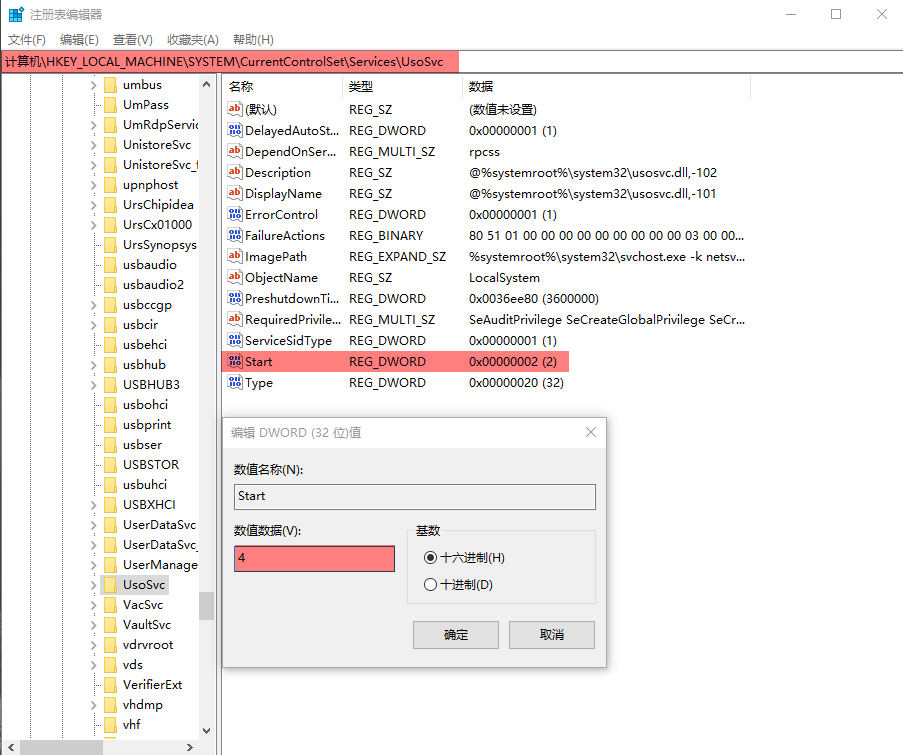
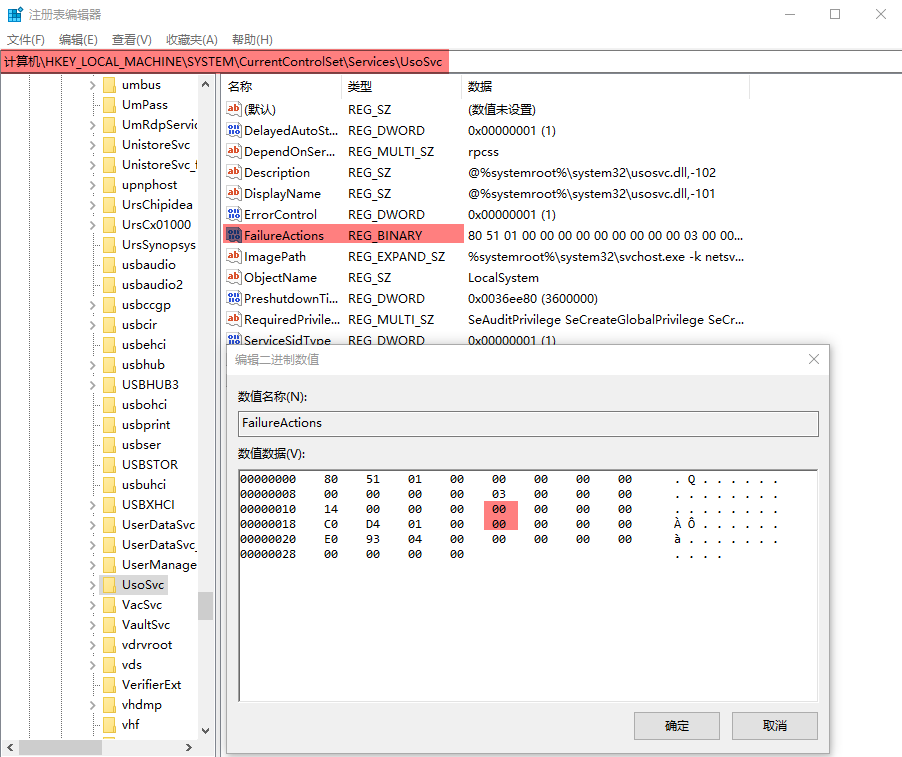
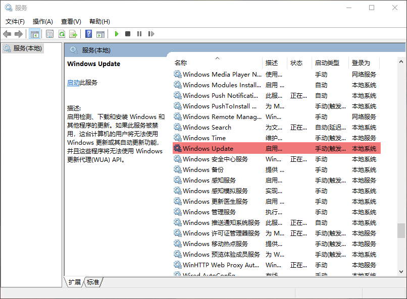
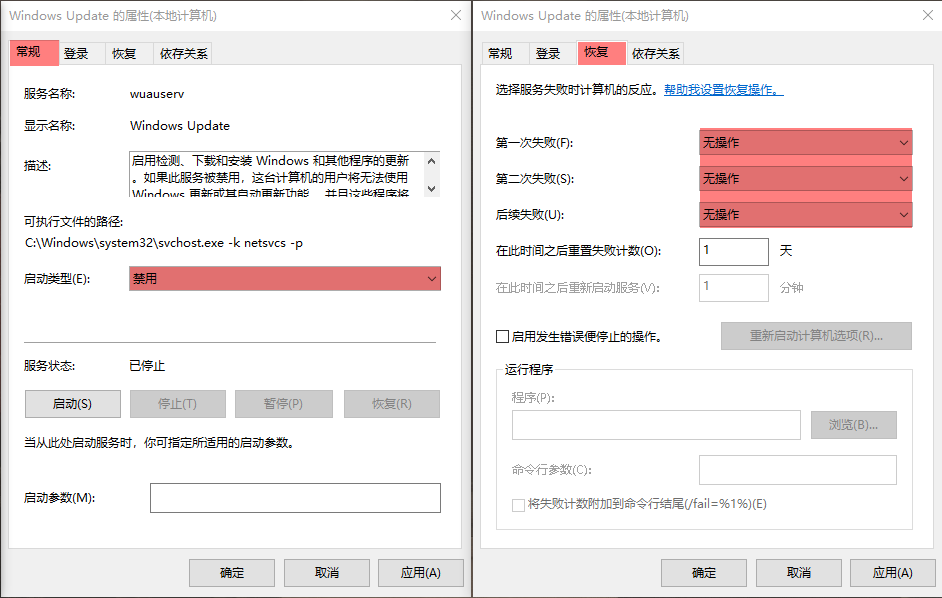
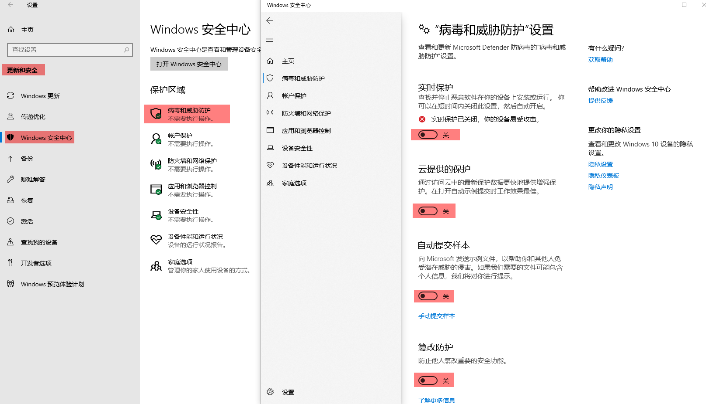
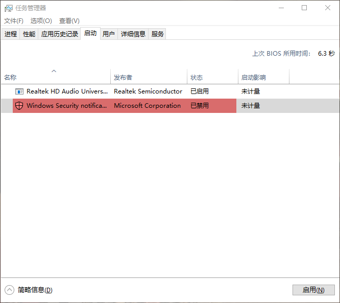
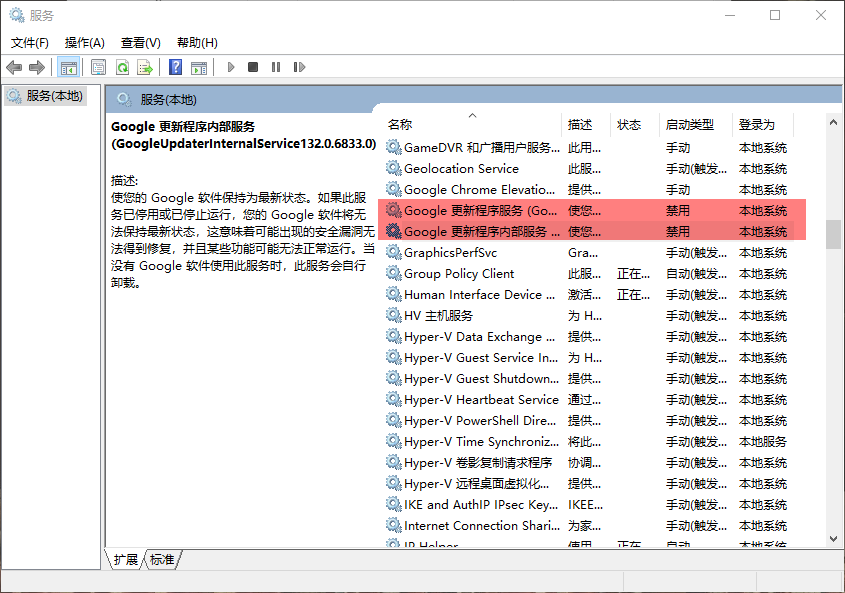

# Windows

---

## ★ Microsoft

- [Microsoft Visual C++ 2015-2022](https://learn.microsoft.com/zh-cn/cpp/windows/latest-supported-vc-redist?view=msvc-170#visual-studio-2015-2017-2019-and-2022)
- [vc_redist.x64](https://aka.ms/vs/17/release/vc_redist.x64.exe)


---

### ☆ Windows Update

#### 1. gpedit

```shell
1. Win+S 搜索 组策略
2. 搜索路径: 计算机配置/管理模板/Windows 组件/Windows 更新
```

- 配置自动更新/已禁用
- 删除所有使用Windows更新功能的访问权限/已启用


#### 2. regedit

```shell
1. Win+S 搜索 注册表
2. 搜索路径: 计算机\HKEY_LOCAL_MACHINE\SYSTEM\CurrentControlSet\Services\UsoSvc
```






#### 3. services

```shell
1. Win+S 搜索 服务
```






---

### ☆ Windows Defender

#### 1. gpedit

```shell
1. Win+S 搜索 组策略
2. 搜索路径: 计算机配置/管理模板/Windows 组件/Windows Defender 防病毒
```

- 关闭 Windows Defender 防病毒/已启用
- 允许反恶意软件服务始终保持运行状态/已禁用
- 实时保护/关闭实时保护/已启用
- 实时保护/扫描所有下载文件和附件/已禁用


#### 2. settings




#### 3. task manager

```shell
# 任务管理器禁用 `Windows Security notification icon`
```




---

## ——————

## ★ apps

### ☆ proxy

- [v2aky](https://dl.v2aky.net/clients/v2aky_windows_4.1.8.exe)


### ☆ snipaste

- [latest](https://dl.snipaste.com/win-x64-cn)


### ☆ Google Chrome

- [129.0.6668.101](https://github.com/charlesbases/lfs/raw/refs/heads/master/google_chrome/win/129.0.6668.101.msi?download=)

```shell
# cmd(M)

# google
md "D:\Google"
mklink /J "C:\Program Files\Google" "D:\Google"
```

```shell
# Win+X 搜索 服务

# Google 更新程序服务(禁用)
# Google 更新程序内部服务(禁用)
```



### ☆ Dockers Desktop

- [v4.34.3](https://desktop.docker.com/win/main/amd64/170107/Docker%20Desktop%20Installer.exe)

  ```shell
  $ docker version
  Client:
   Version:           27.2.0
   API version:       1.47
   Go version:        go1.21.13
   Git commit:        3ab4256
   Built:             Tue Aug 27 14:17:17 2024
   OS/Arch:           windows/amd64
   Context:           default
  ```

  

```shell
# cmd(管理员)

# docker
md "D:\Docker"
mklink /J "C:\Program Files\Google" "D:\Docker"
```


---

## ★ fonts

### ☆ [mononoki](https://github.com/charlesbases/applications/raw/refs/heads/master/Fonts/mononoki.zip?download=)


---

## ★ git-for-windows

### [v2.45.2](https://github.com/git-for-windows/git/releases/download/v2.45.2.windows.1/Git-2.45.2-64-bit.exe)

```shell
# 添加 PATH

# cmd(M)
SETX GITROOT "D:\local\git" /M
SETX PATH "%PATH%;%GITROOT%\bin" /M

# 查看环境变量
set PATH
set GITROOT
```

```shell
# 添加 hosts

# bash(M)
# https://www.ipaddress.com/website/ssh.github.com/
#   搜索 "DNS Resource Records"
cat >> "C:\Windows\System32\drivers\etc\hosts" << EOF

# custom
140.82.114.36 raw.githubusercontent.com
EOF
```

```shell
# bash

# git-bash 删除键闪屏
sed -i -s 's/set bell-style visible/set bell-style none/g' /etc/inputrc

# 历史记录前缀搜索
cat >> /etc/inputrc << EOF
"\e[A": history-search-backward
"\e[B": history-search-forward
EOF

# bash.bashrc
cat >> /etc/bash.bashrc << EOF
# 将每个 session 的历史记录行追加到历史文件中
PROMPT_COMMAND='history -a'

# alias
alias l='ls -lhv'
alias la='ls -alhv'
alias open='start "" '

# environments

EOF

# git-prompt.sh
curl -L https://raw.githubusercontent.com/charlesbases/blogs/master/Git/git-prompt.sh --output /etc/profile.d/git-prompt.sh

# gitconfig(全局配置)
curl -L https://raw.githubusercontent.com/charlesbases/blogs/master/Git/gitconfig --output $HOMR/.gitconfig
```


### ☆ Windows Terminal

- [v1.20.11781.0](https://github.com/microsoft/terminal/releases/download/v1.20.11781.0/Microsoft.WindowsTerminal_1.20.11781.0_x64.zip)

  ```shell
  # bash(M)
  
  # settings.json
  curl -L https://raw.githubusercontent.com/charlesbases/blogs/master/WindowsTerminal/settings.json --output "$HOME/AppData/Local/Microsoft/Windows Terminal/settings.json"
  ```

  

### ☆ wget

- [1.21.4](https://eternallybored.org/misc/wget/1.21.4/64/wget.exe)

  ```shell
  # bash(M)
  curl -L https://eternallybored.org/misc/wget/1.21.4/64/wget.exe --output "C:\Windows\wget.exe"
  ```


### ☆ ssh

```shell
# bash(M)
cd && mkdir .ssh && cd .ssh
ssh-keygen -t rsa -b 2048 -C "zhiming.sun" -f id_rsa
```


